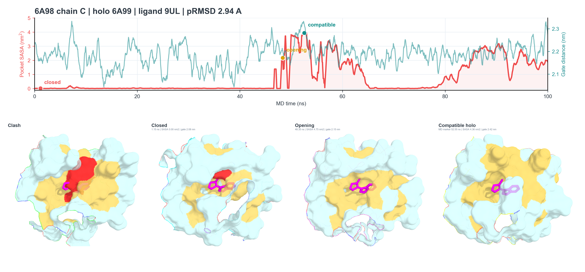

# Dynamics-informed selective structural routing for cryptic binding sites prediction from apo structures

<p align="center">
  
</p>

<p align="center"><em>Illustrative MD trajectory analysis: closed, opening, and ligand-compatible structural states.</em></p>

This repository provides the reference implementation for residue-level
cryptic binding-site prediction from apo protein structures. The method combines
sequence representations, local backbone geometry, dynamics-prior components,
and selective structural routing in one trainable predictor.

## Core release

| Component | Location | Purpose |
|---|---|---|
| Model | [`model.py`](model.py) | Complete model, loader, training loop, and evaluation |
| Configuration | [`config.py`](config.py) | Paths, presets, and experiment hyperparameters |
| Data preparation | [`data_preprocessing/`](data_preprocessing/) | Input construction and consistency checks |
| Processing overview | [`docs/DATASET_PROCESSING.md`](docs/DATASET_PROCESSING.md) | Dataset logic and preprocessing contract |
| Scale table | [`docs/dataset_scale.tex`](docs/dataset_scale.tex) | Manuscript-ready CryptoBench/CryptoBank table |
| References | [`references.bib`](references.bib) | Dataset and resource citations |
| MD visualization | [`md_visualization/`](md_visualization/) | Reproducible scripts for the illustrative MD figure |

Large raw datasets, trajectories, representations, caches, and checkpoints are
not tracked. Their expected layout and provenance are documented in
[`docs/`](docs/) and [`data_preprocessing/`](data_preprocessing/).

## Installation and training

```bash
python -m venv .venv
# Linux/macOS: source .venv/bin/activate
# Windows PowerShell: .venv\\Scripts\\Activate.ps1
python -m pip install --upgrade pip
pip install -r requirements-model.txt
```

Edit `config.py` when prepared inputs are stored outside the default `data/`
layout. Verify the resolved configuration first:

```bash
python model.py --dry_run --out_dir runs/dry-run
```

Run training with:

```bash
python model.py --train_subset apo --test_preset same \\
  --epochs 20 --seed 42 --out_dir runs/apo-seed42
```

## Data and visualization workflow

The preparation stage aligns residue labels to apo chains, constructs cached
structure graphs, computes cached dynamics-prior components, validates all
residue lengths, and then hands the prepared multimodal inputs to `model.py`.
See [`data_preprocessing/README.md`](data_preprocessing/README.md) for the
step-by-step description.

The MD figure is a visual illustration rather than a training input. Its source
scripts and required case-directory layout are documented in
[`md_visualization/README.md`](md_visualization/README.md).

## Dataset scale

The counts follow the statistical units defined by each resource and are
descriptive rather than directly comparable. The manuscript-ready LaTeX source
is [`docs/dataset_scale.tex`](docs/dataset_scale.tex).

| Dataset statistic | CryptoBench | CryptoBank |
|---|---:|---:|
| Structural combinations | 14,054,029 | ~6,000,000 |
| Cryptic combinations | 221,026 | 574,314 |
| Cryptic fraction | 1.57% | 9.6% |
| Apo structures / chains | 1,107 | 81,302 |
| Cryptic binding sites | 1,361 | 5,151 |

## Citation

```bibtex
@article{skrhak2025cryptobench,
  title   = {{CryptoBench}: Cryptic Protein--Ligand Binding Sites Dataset and Benchmark},
  author  = {{\v{S}}krh{'a}k, V{'i}t and Novotn{'y}, Marian and Feidakis, Christos P. and Kriv{'a}k, Radoslav and Hoksza, David},
  journal = {Bioinformatics},
  volume  = {41},
  number  = {1},
  pages   = {btae745},
  year    = {2025},
  doi     = {10.1093/bioinformatics/btae745}
}

@article{martinez2026cryptobank,
  title   = {{CryptoBank}: A Resource for the Identification and Prediction of Cryptic Sites in Proteins},
  author  = {Martinez, Pedro Febrer and Fr{\"o}hlking, Thorben and Borsatto, Alberto and Gervasio, Francesco L.},
  journal = {Science Advances},
  volume  = {12},
  pages   = {eady6364},
  year    = {2026},
  doi     = {10.1126/sciadv.ady6364}
}
```
